# ElasticSearch

## 前言：

### ElasticSearch的发展：

2004 年Shay Banon基于lucene开发了Compass
2010 年Shay Banon重写了Compass，取名Elasticsearch
\- 支持分布式，可水平扩展
\- 降低全文搜索的学习曲线，可以被任何编程语言使用 


### 说明：

elasticsearch在5.0、6.0、7.0几个版本中有比较大的更新。

本次课程使用elasticsearch-7.4.0进行教学

## 目标

1、ElasticSearch产生背景

2、ElasticSearch安装、Head插件安装

3、ElasticSearch相关的概念

4、能够使用postman发送restful请求操作ElasticSearch

6、使用ElasticSearch集成IK分词器

7、ElasticSearch集群搭建


# 第一章：ElasticSearch简介

## 1.1、ElasticSearch简介

Elasticsearch是一个基于Apache Lucene(TM)的开源搜索引擎。无论在开源还是专有领域，Lucene可以被认为是迄今为止最先进、性能最好的、功能最全的搜索引擎库。 但是，Lucene只是一个库。想要使用它，你必须使用Java来作为开发语言并将其直接集成到你的应用中，更糟糕的是，Lucene非常复杂，你需要深入了解检索的相关知识来理解它是如何工作的。 Elasticsearch也使用Java开发并使用Lucene作为其核心来实现所有索引和搜索的功能，但是它的目的是通过简单的 **RESTful API** 来隐藏Lucene的复杂性，从而让全文搜索变得简单。 

## 1.2、同类产品比较solr

Solr 是Apache下的一个顶级开源项目，采用Java开发，它是基于Lucene的全文搜索服务器。Solr提供了比Lucene更为丰富的查询语言，同时实现了可配置、可扩展，并对索引、搜索性能进行了优化 。并自带了图形管理界面。


**数据相对少**的请求下Solr的检索效率更高

**建立索引时**，Solr会产生阻塞IO,查询性能较差，ElasticSearch有优势

**数据量大时**，Solr的搜索效率变低，而ElasticSearch没有明显变化

安装使用方面ElasticSearch更为简单

总结solr查询快，但更新索引时慢（即插入删除慢），用于电商等查询多的应用，比如商品搜索 。

ES建立索引快（即查询慢），即实时性查询快，适用用于数据频繁更新的应用，比如facebook新浪等搜索。

 Solr 是传统搜索应用的有力解决方案，但 Elasticsearch 更适用于新兴的实时搜索应用。

ES没有Solr成熟，学习成本相对较高。


# 第二章 ElasticSearch安装和插件

## 2.1、ElasticSearch安装

下载Es安装包	

ElasticSearch的官方地址：<https://www.elastic.co/guide/en/elasticsearch/reference/master/index.html> 

## 2.2、ES图形化管理界面安装

1）下载head <https://github.com/mobz/elasticsearch-head> 

2)   下载Node.js https://nodejs.org/en/download    	

​     安装完成   在cmd窗口执行node -v查看node.js的版本号   检查是否安装成功

3)   安装grunt

通过node.js的包管理器npm安装grunt为全局命令，grunt是基于Node.js的项目构建工具

`npm install -g grunt-cli`    	

4）执行 npm install （不执行该命宁 使用grunt server命令会报错）

`npm install`

5）elasticsearch-head解压目录下打开命宁窗口

执行 grunt server  启动服务

访问http://localhost:9100  （elasticsearch-head服务端口）

6、配置ElasticSearch跨域访问  修改 config/elasticsearch.yml 文件

```
http.cors.enabled: true
http.cors.allow-origin: "*"
```

需要重启ES服务

7、在head页面输入链接的ElasticSearch地址，点击连接按钮


# 第三章 ElasticSearch的相关概念

## 3.1 概述 

Elasticsearch是面向文档（document oriented）的，这意味着它可以存储整个对象或文档（ducoment）。然而它不仅仅是存储，还会索引(index)每个文档的内容使之能搜索。在Elasticsearch中，你可以对文档（而非成行成列的数据	）进行索引、排序、过滤。Elasticsearch比传统关系型数据库如下。

```
关系型数据库 -> Databases -> Tables -> Rows -> Colums

ElasticSearch -> Indices -> Types ->Documents -> Fields 
```

## 3.2 ElasticSearch的核心概念

### 3.2.1 索引 index

一个索引就是有相似特征的文档集合，比如用户数据索引、订单数据索引、商品数据索引。

一个索引由一个全为小写字母的名字标识，我们在对应这个索引文档中进行索引、搜索、更新和删除的时候，都要使用到这个名字。在一个群集中可以定义任意多个索引。

### 3.2.2 类型type

在一个索引中，你可以定义一个或多个类型，一个类型是你的索引的一个逻辑上的分类，其语义完全由你来定。通常，会为具有一组共同字段的文档定义一个类型，比如说，我们订单数据索引中我们把订单信息作为一个类型，订单相关的物流信息做为一个类型。但在6.0开始建议index只包含一个type，在7.0之后开始去除。

### 3.2.3 字段field

相当于是数据表的字段，对文档根据不同的属性进行的分类标识

### 3.2.4 映射 mapping  (表结构)

mapping是处理数据的方式和规则方面做一些限制，如某个字段的数据类型、默认值、分析器、是否被索引等等，这些都是映射里面可以设置的，其他的就是处理es里面的数据的一些使用规则设置也叫做映射，按着最优规则处理数据对性能提高很大，因此才需要建立映射，并且需要思考如何建立隐射才能对性能更好。

### 3.2.5 文档 document

一个文档是一个可被索引的基础单元。文档以JSON格式来表示，而JSON是一个到处存在的互联网数据交互格式。

在一个index/type里面，你可以存储任意多的文档。

### 3.2.6 ElasticSearch版本问题说明

Elasticsearch 官网提出的近期版本对 type 概念的演变情况如下：

在 **5.X** 版本中，一个 index 下可以创建多个 type；

在 **6.X** 版本中，一个 index 下只能存在一个 type；

在 **7.X** 版本中，直接去除了 type的概念，就是说 index 不再会有 type。

去除type的原因 ：

因为 Elasticsearch 设计初期，是直接查考了关系型数据库的设计模式，存在了 type（数据表）的概念。但是，其搜索引擎是基于 Lucene的，这种 “基因”决定了 type 是多余的。 Lucene 的全文检索功能之所以快，是因为 倒序索引** 的存在。而这种倒序索引 的生成是基于 index 的，而并非 type。

# 第四章 ElasticSearch基本操作

基本操作在学习过程中可以使用单测工具进行，老师在安装包中提供了postman、jmeter安装包。

大家可以根据自己的喜好选择。

因为在学习使用http请求操作Es,必须对RESTful 风格有所了解，所以在学习基本操作前，对RESTful 知识进行补充：

RESTful 在两方面做了相应规范：

1、服务数据交互格式使用json、xml。

2、采用HTTP协议规定的GET、POST、PUT、DELETE动作处理资源的增删该查操作

| Method | CRUD                     |
| ------ | ------------------------ |
| POST   | create（update、delete） |
| GET    | query                    |
| PUT    | update （create）        |
| Delete | delete                   |

## 4.1 ElasticSearch语法

mapping字段详解

| 名称                   | 作用描述                                                     |
| ---------------------- | ------------------------------------------------------------ |
| type                   | 字段数据类型，可选值参考" type可选类型"                      |
| analyzer               | 指定分词器，一般使用最大分词：ik_max_word                    |
| index                  | 该字段是否会被索引和可查询 默认true                          |
| store                  | 默认情况false,其实并不是真没有存储，_source字段里会保存一份原始文档 |
| normalizer             | 字段标准化规则；如把所有字符转为小写                         |
| boost                  | 字段权重；用于查询时评分，关键字段的权重就会高一些，默认都是1；另外查询时可临时指定权重 |
| coerce                 | 清理脏数据：1，字符串会被强制转换为整数 2，浮点数被强制转换为整数 |
| copy_to                | 自定_all字段；指定某几个字段拼接成自定义                     |
| doc_values             | true 加快排序、聚合操作，但需要额外存储空间；默认true，对于确定不需要排序和聚合的字段可false |
| dynamic                | 默认true, #新字段动态添加 true:无限制 false:数据可写入但该字段不保留 'strict':无法写入抛异常 |
| enabled                | 默认true, 是否会被索引，但都会存储;可以针对一整个_doc        |
| fielddata              | 默认false,针对text字段加快排序和聚合.此项官网建议不开启，非常消耗内存 |
| eager_global_ordinals  | 默认true，是否开启全局预加载,加快查询；此参数只支持text和keyword，keyword默认可用，而text需要设置fielddata属性 |
| format                 | 格式化 此参数代表可接受的时间格式<br>"yyyy-MM-dd HH:mm:ss\|\|yyyy-MM-dd\|\|epoch_millis" |
| ignore_above           | 100  指定字段索引和存储的长度最大值，超过最大值的会被忽略    |
| ignore_malformed       | 默认 false,插入文档时是否忽略类型 默认是false 类型不一致无法插入 |
| index_options          | docs .  docs（索引文档号） \ freqs（文档号 + 词频）\ positions（文档号 + 词频 + 位置，通常用来距离查询）  offsets（文档号 + 词频 + 位置 + 偏移量，通常被使用在高亮字段） |
| fields                 | 可以对一个字段提供多种索引模式，使用text类型做全文检索，也可使用keyword类型做聚合和排序 |
| norms                  | true  用于标准化文档，以便查询时计算文档的相关性。建议不开启 |
| null_value             | 可以让值为null的字段显式的可索引、可搜索                     |
| position_increment_gap | 0，词组查询时可以跨词查询 既可变为分词查询 默认100           |
| properties             | 嵌套属性，例如该字段是音乐，音乐还有歌词，类型，歌手等属性   |
| search_analyzer        | 查询分词器;一般情况和analyzer对应                            |
| similarity             | 用于指定文档评分模型，参数有三个<br> BM25 : ES和Lucene默认的评分模型 <br> classic: TF/IDF评分 <br> boolean:布尔模型评分 |
| term_vector            | 默认 "no" ,不存储向量信息 <br> yes : term存储 （term存储）  <br> with_positions  (term + 位置） <br> with_offsets (term + 位置）<br> with_positions_offsets(term + 位置 + 偏移量) <br>对快速高亮fast vector highlighter能提升性能，但开启又会加大索引体积，不适合大数据量用 |

type 可选类型

| 类型         | 具体值                               |
| ------------ | ------------------------------------ |
| 整数类型     | integer,long,short,byte              |
| 浮点类型     | double,float,half_float,scaled_float |
| 逻辑类型     | boolean                              |
| 日期类型     | date                                 |
| 范围类型     | range                                |
| 二进制类型   | binary                               |
| 数组类型     | array                                |
| 对象类型     | nested                               |
| 地理坐标类型 | geo_point                            |
| 地理地图     | geo_shape                            |
| IP类型       | ip                                   |
| 范围类型     | completion                           |
| 令牌计数类型 | token_count                          |
| 附件类型     | attachment                           |
| 抽取类型     | percolator                           |

## 4.2 通过HTTP请求创建

### 4.2.1 仅创建索引

请求方式选择 **PUT**

请求链接在**URL**一级目录输入需要创建的索引

比如我们船舰一个shop的索引

http://127.0.0.1:9200/shop 


### 4.2.2  创建索引的同时创建mapping 以及分片复制参数

​	传入body参数执行

```
{
        "settings" : {
            "number_of_shards":5,
            "number_of_replicas" : 1,
            "refresh_interval":"30s"
        },
        "mappings":{
                "properties":{
                    "shopid":{
                    "type":"text",
                    "store":false,
                    "index":true
                },
                    "shopname":{
                    "type":"text",
                    "store":false,
                    "index":true
                },
                    "shopdesc":{
                    "type":"text",
                    "store":false,
                    "index":true
                }
            }	
        }
    }
```

postman截图


### 4.2.3 删除索引库

请求方式选择**Delete**

请求链接如：http://127.0.0.1:9200/shop   删除shop索引


### 4.2.3 向索引库中添加文档

请求方式选 **POST**

**单条插入**：

请求**url** : http://127.0.0.1:9200/shop/_doc/1      (索引/"**_doc**"/文档id)   

​                或者http://127.0.0.1:9200/shop/_doc 

文档id为Es中的文档主键id，不指定的情况下Es会给我们生成一个唯一的随机字符串，如 `BU7pG24Bm2YrPBUaN0wD` 

```
{
	"shopid":"1234",
	"shopname":"你的小店",
	"shopdesc":"你的小店，只为喂饱你的胃"
}
```

postman截图


**批量添加：**

请求url： http://127.0.0.1:9200/shop/_bulk 

```
{ "index":{} }
{ "shopid":"1234656","shopname":"fox" ,"shopdesc":"亲承5为自己生下5个孩子 此前12个" }
{ "index":{} }
{ "shopid":"1234657","shopname":"乒联" ,"shopdesc":"国际乒联奥地利公开赛正赛展开" }
{ "index":{"_id":"iikdjsd"} }
{ "shopid":"1234658","shopname":"纷纷两连败" ,"shopdesc":"两连败+二当家伤停再遭困境 考验欧文.." }
{ "index":{"_id":"iik3325"} }
{ "shopid":"1234659","shopname":"纷纷返回" ,"shopdesc":"33+9+4+5误！这是最乔治！黑贝最.." }
```

index可以指定参数，比如指定id，不指定则默认生成id

postman截图：

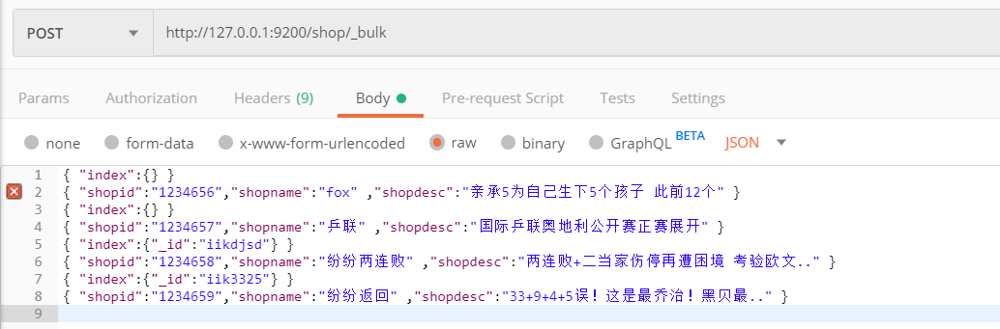

### 4.2.3 删除文档

请求方式选择**Delete**

请求**url** : http://127.0.0.1:9200/shop/_doc/1   (索引/"**_doc**"/文档id)   

### 4.2.4 查询文档

请求方式选择**Get**

请求**url** : http://127.0.0.1:9200/shop/_doc/1   (索引/"**_doc**"/文档id)   

### 4.2.5 修改文档

请求方式选择**POST**

请求**url** : http://127.0.0.1:9200/shop/_doc/1   (索引/"**_doc**"/文档id)  

```
 {
	"shopname":"fox"		
}
```


### 4.2.6 根据关键词查询文档

请求方式选择**Get**

请求url  http://127.0.0.1:9200/shop/_doc/_search        (索引/"**_doc**"/"**_search**")   

请求参数query、term为固定命宁，shopdesc为指定在哪个字段查询什么关键字（支持什么样的关键字查询取决于mapping里指定的分析器，比如单个字为索引、分词索引，之前测试的语句都是标准分词，以单个字为索引，所以查询的时候只支持一个汉字，如果输入多个则查询不到数据）

```
{
	"query":{
		"term":{
			"shopdesc":"店"
		}
	}
}
```

postman截图

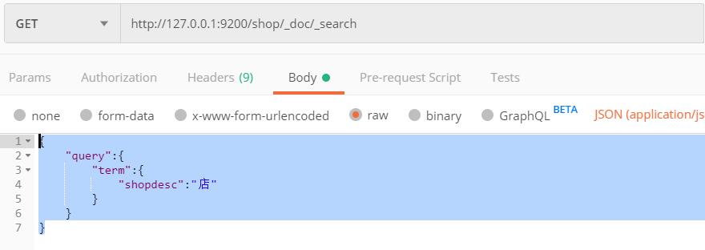

### 4.2.7 queryString查询

queryString是讲输入参数进行分词然后去索引库中检索。

请求方式选择**Get**

请求url  http://127.0.0.1:9200/shop/_doc/_search

请求参数

```
{
	"query":{
		"query_string":{
			"default_field":"shopname",
			"query":"小店"
		}
	}
}
```

postman截图

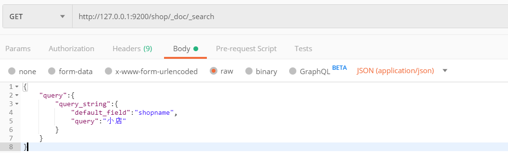


# 第五章 ElasticSearch IK中文分词器 

## 5.1 什么是分词器？为什么要分词器？

在上面的学习例子中我们使用的是Es默认的分词器，在中文的分词上并不友好，会将语句每个字进行分词作为索引，所以在使用Term关键字查询的时候多个汉字无法命中文档。这个时候就需要一个合理的分词规则，将一个完整的语句划分为多个比较复合表达逻辑的独立的词条。

分词器包含三个部分：

- character filter：分词之前的预处理，过滤掉HTML标签、特殊符号转换（例如，将&符号转换成and、将|符号转换成or）等。
- tokenizer：分词
- token filter：标准化

## 5.2 ElasticSeach内置分词器

**standard分词器**：（默认的）它将词汇单元转换成小写形式，并去掉停用词（a、an、the等没有实际意义的词）和标点符号，支持中文采用的方法为单字切分（例如，‘你好’切分为‘你’和‘好’）。

**simple分词器**：首先通过非字母字符来分割文本信息，然后将词汇单元同一为小写形式。该分析器会去掉数字类型的字符。

**Whitespace分词器**：仅仅是去除空格，对字符没有lowcase（大小写转换）化，不支持中文；并且不对生成的词汇单元进行其他的标准化处理。

**language分词器**：特定语言的分词器，不支持中文。


## 5.3 IK分词器

### 5.3.1 IK分词器简介

IK分词器在是一款 基于词典和规则 的中文分词器，提供了两种分词模式：ik_smart （智能模式）和ik_max_word （细粒度模式）

输入数据

```
数据：IK Analyzer是一个结合词典分词和文法分词的中文分词开源工具包。它使用了全新的正向迭代最细粒度切分算法。 
```

  智能模式效果：

```
ik  analyzer  是  一个  结合  词典  分词  和  文法  分词  的  中文  分词  开源  工具包  它  使  用了  全新  的  正向  迭代  最  细粒度  切分  算法 
```

细粒度模式：

```
ik  analyzer  是  一个  一  个  结合  词典  分词  和文  文法  分词  的  中文  分词  开源  工具包  工具  包  它  使用  用了  全新  的  正向  迭代  最  细粒度  细粒  粒度  切分  切  分  算法 
```

### 5.3.2 ElasticSearch集成Ik分词器

Ik分词器下载 <https://github.com/medcl/elasticsearch-analysis-ik> 

安装包中提供了支持ES 7.0X的Ik压缩包，如果使用其他ES版本注意下载对应版本。

（不同版本的集成可能会有所区别）

解压后进行编译打包 

mvn clean
mvn compile
mvn package

拷贝和解压release下的文件: #{project_path}/elasticsearch-analysis-ik/target/releases/elasticsearch-analysis-ik-*.zip 到你的 elasticsearch 插件目录, 如: plugins/ik并解压
重启elasticsearch

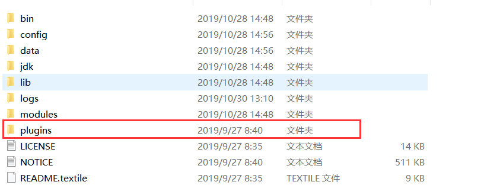

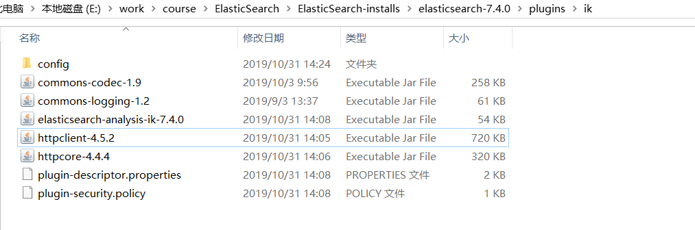


### 5.3.3 使用ElasticSearch中的 analyze 测试Ik分词效果

请求方式post

请求url http://127.0.0.1:9200/_analyze 

请求参数：

```
{
	"analyzer":"ik_smart",
	"text":"我们是一群牛逼的程序员"
}
```

输出效果

```
{

​    "tokens": [

​        {

​            "token": "我们",

​            "start_offset": 0,

​            "end_offset": 2,

​            "type": "CN_WORD",

​            "position": 0

​        },

​        {

​            "token": "是",

​            "start_offset": 2,

​            "end_offset": 3,

​            "type": "CN_CHAR",

​            "position": 1

​        },

​        {

​            "token": "一群",

​            "start_offset": 3,

​            "end_offset": 5,

​            "type": "CN_WORD",

​            "position": 2

​        },

​        {

​            "token": "牛",

​            "start_offset": 5,

​            "end_offset": 6,

​            "type": "CN_CHAR",

​            "position": 3

​        },

​        {

​            "token": "逼",

​            "start_offset": 6,

​            "end_offset": 7,

​            "type": "CN_CHAR",

​            "position": 4

​        },

​        {

​            "token": "的",

​            "start_offset": 7,

​            "end_offset": 8,

​            "type": "CN_CHAR",

​            "position": 5

​        },

​        {

​            "token": "程序员",

​            "start_offset": 8,

​            "end_offset": 11,

​            "type": "CN_WORD",

​            "position": 6

​        }

​    ]

}
```


### 5.3.4 Ik分词器停用词和扩展词

在实际使用过程中Ik分词算法的过程中，还有一些场景的分词规则是Ik无法设计的，比如之前的例子中"牛逼"作为一个网络用语没有被解析成一个词条，以及其中的**“的”**这样的助词往往在建立索引的时候是没有必要的。所以IK支持停用词和扩展词的配置。

需要修改配置文件

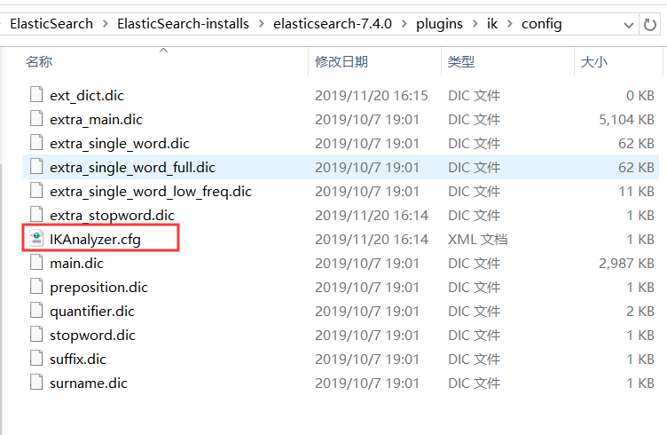

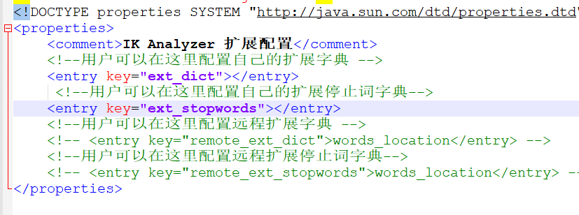

ext_dict填入扩展词文件

ext_stopwords填入停用词文件

文件以dic后缀结尾，需要和IKAnalyzer.cfg在同级目录。

dic文件每个词需要占一行。

# 第六章 ElasticSearch集群

### 6.1 集群 cluster

一个集群就是一个或多个节点组织在一起，他们共同持有整个库的数据，并在一起提供索引和搜索功能，一个集群由一个唯一的名字表示。所有节点通过这个集群名字，来进入这个集群。

### 6.2 节点node

一个节点是由集群中的一个服务器，作为集群的一部分，它存储数据，参与集群的索引和搜索功能。和集群类似，一个节点也是由一个名字来标识的，默认情况下，这个名字是一个随机的。

一个节点可以通过配置集群名称的方式来加入一个指定的集群。

### 6.3 分片和复制 shard & replicas

**分片：**

一个索引可以存储超过单个节点硬件限制的大量数据，比如说一个索引具有10亿文档，占据1T的磁盘空间，而任意一个节点都没有这样大的一个磁盘空间；或者单个节点处理搜索请求，响应太慢了，为了解决这个问题，ElasticSearch提供了将索引划分为多份的能力，每一份就叫做一个分片。当建立一个索引的时候，可以指定想要分配的分片数量。每个分片本身也是一个功能晚上并且独立的“索引”，这个“索引”可以被放置到集群中的任何节点上。分片很重要，主要体现在两方面：a、允许你水平分割/扩展你的内容容量。2) 允许你在分片之上进行分布式并行操作，从而提高性能和吞吐量

至于分片怎么分布，查询结果怎么聚合，完全由elasticsearch管理的。开发者不需要关心。

**复制：**

在网络环境或者说分布式环境中，通讯发生失败是常有的事，所以当某个分片节点出现故障，故障转移机制是非常有必要的。因此Elasticsearch允许你船舰分片的一份或者多份拷贝，这些拷贝叫做复制分片，或者就叫复制。复制的存在提高了节点出现故障时的集群高可用性。因为这个原因，复制分片应注意与主分片不能在同一个节点上。

总结的说，一个索引可以被分为多个分片，可以被复制0~N次，一旦复制了就有了主分片和复制分片之别。分片和复制的数量可以在索引创建的时候指定。在索引创建之后，复制的数量可以改变，但是分片数量不能改变。

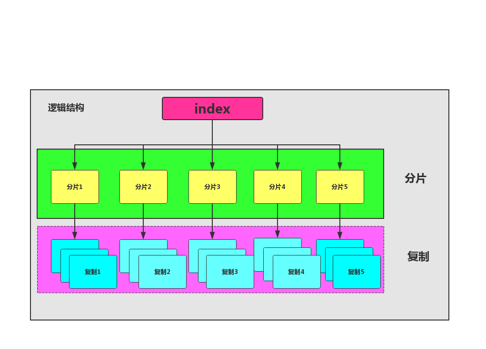


### 6.4 节点的4中类型

**主节点：**

即 Master 节点。主节点的主要职责是和集群操作相关的内容，如创建或删除索引，跟踪哪些节点是群集的一部分，并决定哪些分片分配给相关的节点。稳定的主节点对集群的健康是非常重要的。默认情况下任何一个集群中的节点都有可能被选为主节点。索引数据和搜索查询等操作会占用大量的cpu，内存，io资源，为了确保一个集群的稳定，分离主节点和数据节点是一个比较好的选择。虽然主节点也可以协调节点，路由搜索和从客户端新增数据到数据节点，但最好不要使用这些专用的主节点。一个重要的原则是，尽可能做尽量少的工作。

**数据节点：**

即 Data 节点。数据节点主要是存储索引数据的节点，主要对文档进行增删改查操作，聚合操作等。数据节点对 CPU、内存、IO 要求较高，在优化的时候需要监控数据节点的状态，当资源不够的时候，需要在集群中添加新的节点。

**预处理节点：**

也称作 Ingest 节点，在索引数据之前可以先对数据做预处理操作，所有节点其实默认都是支持 Ingest 操作的，也可以专门将某个节点配置为 Ingest 节点。
以上就是节点几种类型，一个节点其实可以对应不同的类型，如一个节点可以同时成为主节点和数据节点和预处理节点，但如果一个节点既不是主节点也不是数据节点，那么它就是负载均衡节点。具体的类型可以通过具体的配置文件来设置。

| 节点类型   | 默认配置          | 专用节点                                                     | 注意事项                                                     |
| ---------- | ----------------- | ------------------------------------------------------------ | ------------------------------------------------------------ |
| 主节点     | node.master: true | node.master: true                node.data: false                 node.ingest: false cluster.remote.connect: false | discovery.zen.minimum_master_nodes: 1（防止脑裂设置）<br/>意思是最少需要多少node.master: true 的节点集群才能工作<br/>建议(master_eligible_nodes / 2) + 1<br/>比如能node.master: true节点有6个 (6/2)+1=4<br/>那么如果健康节点少于4集群将不能工作 |
| 数据节点   | node.data: true   | node.master: false               node.data: true                  node.ingest: false cluster.remote.connect: false | 建议使用SSD硬盘缓解I/O压力                                   |
| 预处理节点 | node.ingest       | node.master: false               node.data: false                 node.ingest: true cluster.remote.connect: false | 节点负载将会很高，建议使用专用节点作为Ingest node 分片交互   |

### 6.5 分片交互

​           我们能够发送请求给集群中任意一个节点。每个节点都有能力处理任意请求。每个节点都知道任意文档所在的节点，所以也可以将请求转发到需要的节点。下面的例子中，我们将发送所有请求给`Node 1`，这个节点我们将会称之为**请求节点(requesting node)** 。 当我们发送请求，最好的做法是循环通过所有节点请求，这样可以平衡负载,或者借助nginx、apache等反向代理服务器进行负载。

 

#### 6.5.1 新建、删除索引和删除文档时

 新建、索引和删除请求都是**写(write)**操作，它们必须在主分片上成功完成才能复制到相关的复制分片上。 

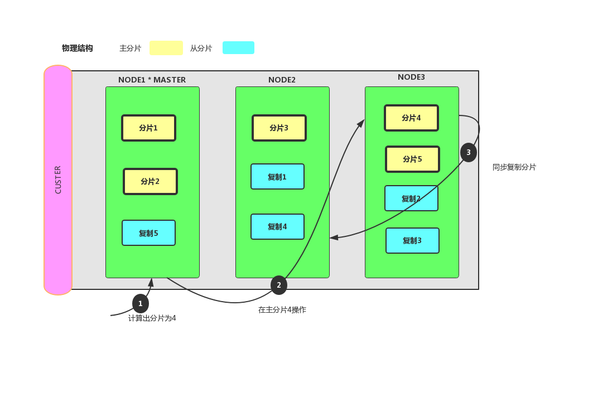

#### 6.5.2 单条检索文档集群交互流程

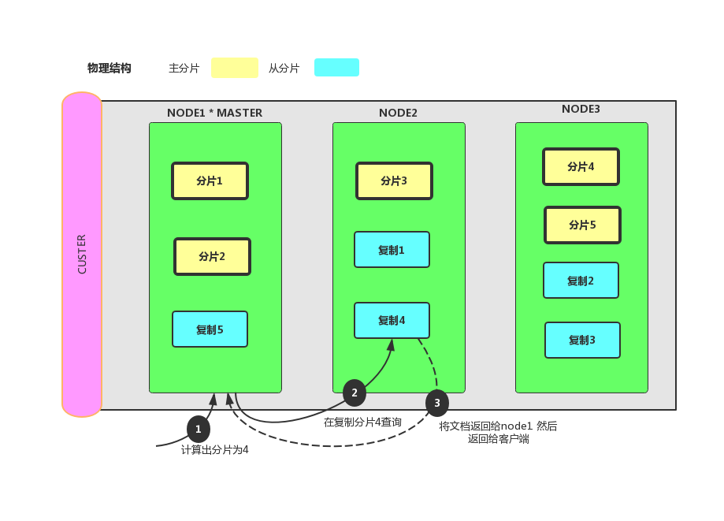

#### 6.5.3 批量查询文档

 请求拆成每个分片的请求，然后转发每个参与的节点。 

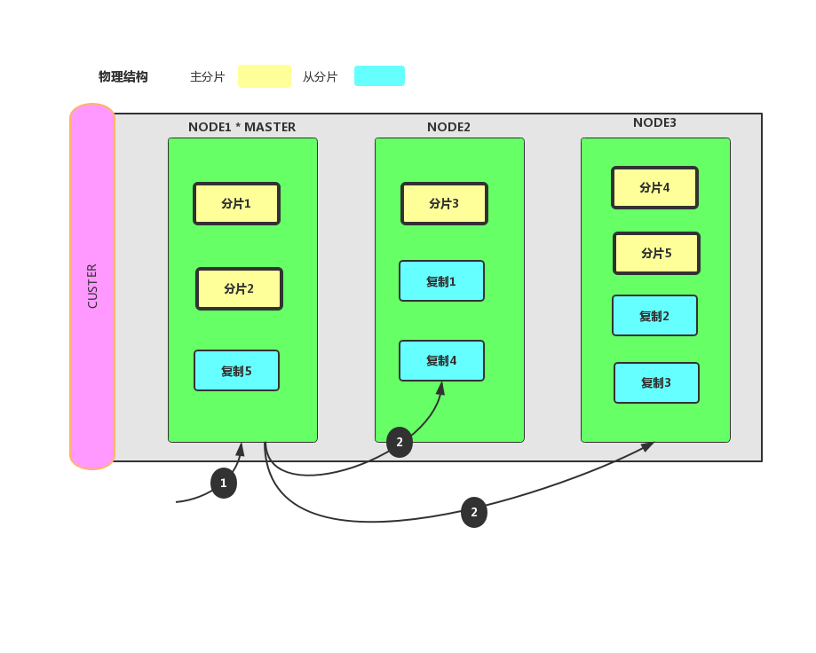

### 6.6 集群搭建配置信息

对于一个新建的节点需要保证 安装目录的**data** 目录为空

修改 **elasticsearch.yml** 配置文件

注意冒号后面的空格。

```
#集群名称
cluster.name: my-elasticsearch
#节点名称,不同的节点名称必须不一样
node.name: node-1
# 是否可以成为master节点
node.master: true
#必须为本机的ip地址
network.host: 127.0.0.1
#服务端口，在同一机器下必须不一样
http.port: 9201
#集群间通讯端口号,在同一机器必须不一样
transport.tcp.port: 9301
#集群节点
discovery.seed_hosts:
    -  127.0.0.1:9301
    -  127.0.0.1:9302
    -  127.0.0.1:9303
    
#集群中的主节点
cluster.initial_master_nodes:
    - 127.0.0.1:9301
```

不同节点注意修改节点名称、服务端口、通讯端口、以及是否可以成为主节点属性。

修改完毕后依次启动不同节点服务。


# 第七章 JAVA应用集成ElasticSearch客户端

ElasticSearch对外提供Restful风格接口，所以客户端的本质就是讲对应的DSL语句抽象成接口封装，然后组装成

HTTP请求发送到Es服务端。但由于ElasticSearch的版本要求较高，必须使用跟服务端对应的版本。

## 7.1 Elasticsearch官方为Java提供了三种客户端API:

**1、TransportClient：**这种方式通过TCP与Elasticsearch服务进行交互。

**2、Java Low Level REST Client:** 低级别的REST客户端，通过http与集群交互，用户需自己编组请求JSON串，及解析响应JSON串。兼容所有ES版本。

**3、Java High Level REST Client**: 高级别的REST客户端，基于低级别的REST客户端，增加了编组请求JSON串、解析响应JSON串等相关api。使用的版本需要保持和ES服务端的版本一致，否则会有版本问题。

**官方文档地址:** 

https://artifacts.elastic.co/javadoc/org/elasticsearch/client/elasticsearch-rest-high-level-client/7.4.2/index.html 

**Maven依赖**

```
<dependencies>
        <dependency>
            <groupId>org.elasticsearch</groupId>
            <artifactId>elasticsearch</artifactId>
            <version>7.4.0</version>
        </dependency>
        <dependency>
            <groupId>org.elasticsearch.client</groupId>
            <artifactId>elasticsearch-rest-high-level-client</artifactId>
            <version>7.4.0</version>
            <exclusions>
                <exclusion>
                    <groupId>org.elasticsearch</groupId>
                    <artifactId>elasticsearch</artifactId>
                </exclusion>
            </exclusions>
        </dependency>
        <dependency>
            <groupId>commons-logging</groupId>
            <artifactId>commons-logging</artifactId>
            <version>1.2</version>
        </dependency>
        <dependency>
            <groupId>org.apache.logging.log4j</groupId>
            <artifactId>log4j-to-slf4j</artifactId>
            <version>2.9.1</version>
        </dependency>
        <dependency>
            <groupId>org.slf4j</groupId>
            <artifactId>slf4j-api</artifactId>
            <version>1.7.24</version>
        </dependency>
        <dependency>
            <groupId>org.slf4j</groupId>
            <artifactId>slf4j-simple</artifactId>
            <version>1.7.21</version>
        </dependency>
<!--        json工具包可选-->
        <dependency>
            <groupId>com.alibaba</groupId>
            <artifactId>fastjson</artifactId>
            <version>1.2.4</version>
        </dependency>
<!--        单元测试，可选-->
        <dependency>
            <groupId>junit</groupId>
            <artifactId>junit</artifactId>
            <version>4.12</version>
            <scope>test</scope>
        </dependency>
        <dependency>
            <groupId>org.junit.jupiter</groupId>
            <artifactId>junit-jupiter</artifactId>
            <version>RELEASE</version>
            <scope>compile</scope>
        </dependency>
    </dependencies>
```


## 7.2 Spring Data Elasticsearch说明

Spring Data Elasticsearch作为Spring Data的一个子项目，封装了对EalsticSearch的客户端，但是最新的3.2版本也仅支持Elasticsearch 6.8.1。 

###  New in Spring Data Elasticsearch 3.2

- Secured Elasticsearch cluster support with Basic Authentication and SSL transport.
- Upgrade to Elasticsearch 6.8.1.
- Reactive programming support with [Reactive Elasticsearch Operations](https://docs.spring.io/spring-data/elasticsearch/docs/3.2.2.RELEASE/reference/html/#elasticsearch.reactive.operations) and [Reactive Elasticsearch Repositories](https://docs.spring.io/spring-data/elasticsearch/docs/3.2.2.RELEASE/reference/html/#elasticsearch.reactive.repositories).
- Introduction of the [ElasticsearchEntityMapper](https://docs.spring.io/spring-data/elasticsearch/docs/3.2.2.RELEASE/reference/html/#elasticsearch.mapping.meta-model) as an alternative to the Jackson `ObjectMapper`.
- Field name customization in `@Field`.
- Support for Delete by Query.


# 第八章 ElasticSearch 高级用法

## 8.1 别名在实战中的使用


## 8.2 复合查询 （待补充）

filter:过滤，不参与打分
must:如果有多个条件，这些条件都必须满足 and与
should:如果有多个条件，满足一个或多个即可 or或
must_not:和must相反，必须都不满足条件才可以匹配到 ！非发生 描述

must
该条款（查询）必须出现在匹配的文件，并将有助于得分。

filter
子句（查询）必须出现在匹配的文档中。然而不像 must查询的分数将被忽略。Filter子句在过滤器上下文中执行，这意味着评分被忽略，子句被考虑用于高速缓存。

should
子句（查询）应该出现在匹配的文档中。如果 bool查询位于查询上下文中并且具有mustor filter子句，则bool即使没有should查询匹配，文档也将匹配该查询 。在这种情况下，这些条款仅用于影响分数。如果bool查询是过滤器上下文 或者两者都不存在，must或者filter至少有一个should查询必须与文档相匹配才能与bool查询匹配。这种行为可以通过设置minimum_should_match参数来显式控制 。

must_not
子句（查询）不能出现在匹配的文档中。子句在过滤器上下文中执行，意味着评分被忽略，子句被考虑用于高速缓存。因为计分被忽略，0所有文件的分数被返回。
